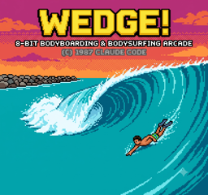

# WEDGE! — 8-bit bodyboarding arcade game



**[Play it live →](https://wedge-game.vercel.app)**

An NES-style arcade game in one continuous view: you float in the lineup at The Wedge,
waves build behind the riders and peel left to right, and you read each one — track the
shifting takeoff spot on makeable waves, let the closeouts pass, and hold the pocket
through the tube. 3 lives. See [PLAN.md](PLAN.md) for the original design (v2 loop below).

## Run it

Any static server from this directory (ES modules need http, not file://):

```sh
python3 -m http.server 8020
# open http://localhost:8020
```

## Controls

| Input | Lineup (watch) | In the tube |
|---|---|---|
| ← → | track the shifting takeoff marker | — |
| ↑ ↓ | — | steer to stay between the pocket lines |
| X | commit to the wave | — |
| Enter | start / confirm | |
| P / M | pause / music toggle (keyboard only) | |

Touch: your finger is the controller — drag anywhere and the rider follows it
(horizontally in the lineup, vertically in the tube). Quick tap = commit/start/confirm.
A white box shows where the game thinks your finger is.

## Reading the wave

- **Feathering only near the peak** = makeable. A blinking ▼ marker appears on the
  shoulder — get under it and commit (X). Closer to dead-center = bigger drop bonus.
- **Feathering across the whole crest** = closeout. Don't go — letting it pass pays +150.
  Going anyway costs a life.
- The peak (and marker) **drifts** as the wave builds; drift speed rises with the stage.
- In the tube, the pocket oscillates. Stray outside the lines and the BURIED meter fills;
  full = wipeout. Tube time × combo pays out when you're spit out.

## v2 gameplay revision (2026-07-03)

The original paddle-out / takeoff / ride phases were replaced with a single continuous
lineup view (Joel's direction): focus on the graphics of the wave building and closing,
a shifting ideal takeoff spot, ridable vs. unridable tubes, and the rider disappearing
behind the curtain and coming through. Tube mechanic: hold-the-line (steer to stay in
the moving pocket).

## Status

Playable end to end with full sprite/backdrop art, bot-verified difficulty tuning, and
mobile touch controls. Live at [wedge-game.vercel.app](https://wedge-game.vercel.app)
(standalone deploy repo: [github.com/joelgum/wedge-game](https://github.com/joelgum/wedge-game)).
See [MARKETABILITY_PLAN.md](MARKETABILITY_PLAN.md) for the onboarding/retention/skill-ceiling
upgrade spec and its phase status.
`window.__wedge` is a debug handle used for automated testing.
