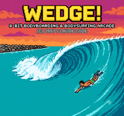

# WEDGE! — 8-bit bodyboarding arcade game



**[Play it live →](https://wedge-game.vercel.app)**

An NES-style arcade game in one continuous view: you float in the lineup at The Wedge
alongside a mixed crowd of spongers and bodysurfers, waves build behind the riders and
peel left to right, and you read each one — track the
shifting takeoff spot on makeable waves, let the closeouts pass, and hold the pocket
through the tube. 3 lives. See [PLAN.md](PLAN.md) for the original design (v2 loop below).

## Run it

Any static server from this directory (ES modules need http, not file://):

```sh
python3 -m http.server 8020
# open http://localhost:8020
```

## Controls

| Input | Lineup (watch) | In the tube |
|---|---|---|
| ← → | track the shifting takeoff marker | — |
| ↑ ↓ | — | steer to stay between the pocket lines |
| X | commit to the wave — **press again within 1.5s to pull back off it** | tap a trick — the move depends on where you are in the band |
| Z | — | held stance, from any height between the lines — press again to stand back up |
| Enter | start / confirm | |
| P / M | pause / music toggle (keyboard only) | |

### Pull back — committing isn't final

Press **X / tap a second time within 1.5 seconds** and you get off the wave: he climbs up
the face, punches out over the back in a burst of spray, and is left treading water in the
flat while the wave peels off without him. Works on **any** wave. It never costs a life and
never touches your streak — bailing a closeout or a wave that's too big pays **+75** for the
late read, bailing someone else's wave pays **+250**, and bailing a wave you could have made
is simply WAVE WASTED. Whatever the drop paid you gets handed back, because you didn't ride it.

Touch: your finger is the controller — drag anywhere and the rider follows it
(horizontally in the lineup, vertically in the tube). Quick tap = commit/start/confirm.
A white box shows where the game thinks your finger is.

### Tricks — two buttons; X reads the band, Z doesn't

**X** picks its move from where you are. **Z** is the held stance, and it goes from *any*
height between the lines — so at every point on the wave you have a choice of two.

| | Bodyboarder | Bodysurfer |
|---|---|---|
| **X, high** (up by the lip) | AIR — launch, rotate, land back in the band | SPAT OUT — pull under the curtain and come flying out |
| **X, anywhere else** | 360 SPIN — pivots flat on the deck | 360 ROLL — rolls prone over his own long axis |
| **Z, any height** | KNEE DROP + hand drag | LAY-BACK, arm spread |

Every one of the six has its own drawn frame (`assets/spr_*`, generated from
[SPRITE_PROMPTS.md](SPRITE_PROMPTS.md) and cut to size by `execution/pixelate_sprite.py`).

The bodysurfer never leaves the water: where the boarder goes over the lip, he goes under
it. Same bargain either way — you're out of your own hands for a beat while the channel
keeps wandering, and you have to come back to it.

The held stance is the one that asks for commitment. It has **its own button (Z)** — X is
already doing commit, pull back and the tap-tricks — and it's a **toggle**: press once to go
down, press again to stand up. He'll stay down there for as long as you can hold the pocket,
which can be the entire wave. Steering runs at full rate while he's down, so what limits it is
reading the channel, not fighting the controls. Height doesn't gate it, so it's the one move
you can always reach — the price is that you're committed to a line while the channel wanders.

You have to stay **set in the lean for a full second** before it counts at all: stand up sooner,
or slip out of the pocket before it locks, and you forfeit every point it had earned. A meter
fills above the rider and flashes SET when it takes, and after that a running tally shows what's
riding on it. Locking it in pays a bonus on top of what the lean earns per second, and once
locked the pot is yours — losing the pocket from there banks it rather than burning it.

On touch there's no second button, so a finger parked down without dragging is the toggle.

Tricks are the main way you score. Linking them without losing the pocket builds a
**chain multiplier** (up to 2.4×) on top of the wave streak. You can't steer mid-trick and
the drift never stops, so a greedy trick buries you — and an air that comes down outside
the band scores nothing and starts the BURIED clock, because the channel wanders while
you're up there.

Everything except the air is a **drawn-out move**, and the break eats that time back in
ground: the whitewater closes right up on your tail while you're spinning or set in the
stance, and drops off again once you're trimming. It still can't overtake you.

## Reading the wave

- **The locals are individuals.** Each of the three rolls a rider type *and* an identity at
  the start of a run and keeps both — different board, trunks and fins, dealt without
  replacement so you never get the same person twice. The one who drops in on you is a
  face you've been sitting next to all session.
- **Someone else's wave.** Roughly one in five makeable waves, a local swings deep and
  starts stroking for it — he ends up on your left, nearer the peak, labelled **HIS WAVE**.
  He has the right of way. Let it go for +150, or take off and pull back out of it for
  +250. Ride it anyway and he'll scream past on the inside while the lip throws you over —
  *DON'T SNAKE WAVES, KOOK.*
- **Feathering only near the peak** = makeable. A blinking ▼ marker appears on the
  shoulder — get under it and commit (X). Closer to dead-center = bigger drop bonus.
- **Feathering across the whole crest** = closeout. Don't go — letting it pass pays +150.
  Going anyway costs a life.
- **A wave that's simply too big** feathers like a makeable one — the size is the only tell.
  The lineup shouts **OUT DA BACK!** in the last second and a half of the build, but that's
  confirmation of a read you should already have made, not the read itself. One bomb a
  session actually *is* makeable; its tell is that it rumbles early.
- **Put a drop dead-centre on the peak** (IN THE SLOT) and you're offered an **instant replay**
  of the whole thing at 0.5× once the ride is complete — as are the bomb waves. Wipe out
  partway through and there's nothing to show.
- The peak (and marker) **drifts** as the wave builds; drift speed rises with the stage.
- In the tube the pocket **wanders** — a smooth, non-repeating channel (three sines with
  no common period + per-ride phases), drawn all the way down the line with look-ahead so
  you can see it coming. Stray outside the lines and the BURIED meter fills; full =
  wipeout. Tricks + tube time × combo pay out when you're spit out.
- The wave is **breaking behind you and eating forward**: blue face ahead of the break,
  boiling churn where it's turning over right now, white tumbling whitewater behind. It
  never overtakes you — losing the pocket is still the only thing that ends a ride.

## v2 gameplay revision (2026-07-03)

The original paddle-out / takeoff / ride phases were replaced with a single continuous
lineup view (Joel's direction): focus on the graphics of the wave building and closing,
a shifting ideal takeoff spot, ridable vs. unridable tubes, and the rider disappearing
behind the curtain and coming through. Tube mechanic: hold-the-line (steer to stay in
the moving pocket).

## Status

Playable end to end with full sprite/backdrop art, bot-verified difficulty tuning, and
mobile touch controls. Live at [wedge-game.vercel.app](https://wedge-game.vercel.app)
(standalone deploy repo: [github.com/joelgum/wedge-game](https://github.com/joelgum/wedge-game)).
See [MARKETABILITY_PLAN.md](MARKETABILITY_PLAN.md) for the onboarding/retention/skill-ceiling
upgrade spec and its phase status.
`window.__wedge` is a debug handle used for automated testing.
